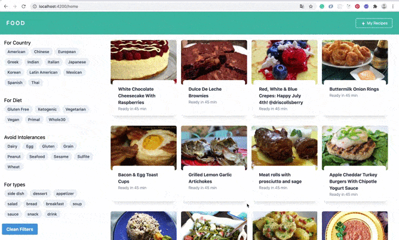

# Angular FOOD 🍇🍳🥗🍕🍗

This is an Angular App using the [Spoonacular API](https://spoonacular.com/).

## Resources

- [Angular CLI](https://github.com/angular/angular-cli) version 8.3.0 ❤️
- [Tailwindcss](https://tailwindcss.com/) as CSS Framework. 🌨
- An Account in [Spoonacular](https://spoonacular.com/food-api/docs). 🥄

This application was created in order to reinforce the knowledge of Angular and TailwindCSS.

### Topics that you can find within the app:

- Routing
- Communication between components (Input, Output)
- Rest Services
- Providers
- Stateful and Stateless Components
- Angular animations
- Design with Tailwindcss
- CSS Grid and Flexbox

## Development server

Run `ng serve` for a dev server. Navigate to `http://localhost:4200/`. The app will automatically reload if you change any of the source files.

After create your account in [Spoonacular](https://spoonacular.com/food-api/docs) remember to change the **API_KEY** that is in _src/app/constants/settings.ts_ for yours.

> The free version of Spoonacular only allows 150 requests/day.
